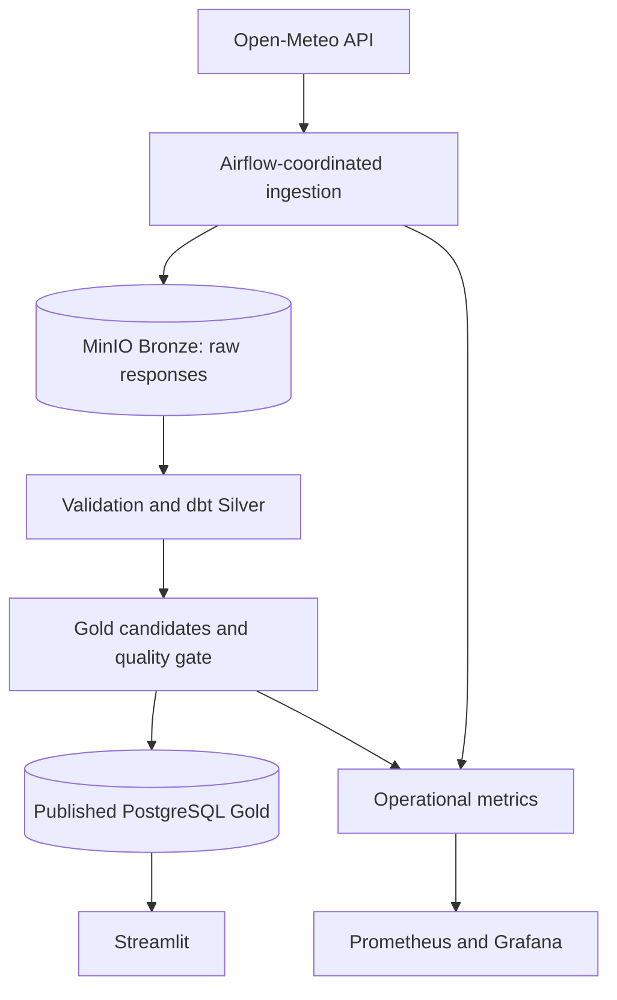

# SILID: Philippine Weather & Productivity Data Platform

SILID is a Philippine weather data engineering portfolio project. Its target is
an auditable hourly pipeline that turns weather forecasts into explainable work
and workout suitability scores.

**Current status:** Step 0 contracts and Step 1 Python development baseline are
implemented. The repository still contains a prototype extractor/JSONB loader.
MinIO Bronze, trusted Silver/Gold, scheduled DAGs, scoring, and the dashboard
remain future steps. The diagram describes the target architecture.



## Development quickstart

Use Python **3.12** and uv **0.11.23**. See the
[uv installation instructions](https://docs.astral.sh/uv/getting-started/installation/)
for your platform. From the repository root:

```bash
uv sync --locked
uv run --locked python -m config.check --env-file .env.example
uv run --locked ruff check .
uv run --locked ruff format --check .
uv run --locked pytest
uv pip check
uv build
```

`uv sync` creates an isolated `.venv` and installs the project. `--locked` refuses
unrecorded dependency changes. The configuration check contacts no external
services and does not print credentials. Unit tests use fakes and require no API,
database, Docker, or local `.env` file. Initial package installation needs network
access; installed tests run offline.

The example file contains public development placeholders. For a real connection,
create your own ignored `.env` from the example **only if you do not already have
one**, then edit its settings. Existing users: rename `DB_NAEME` to `DB_NAME` and
supply all five `DB_*` fields; the application no longer falls back to `POSTGRES_*`.
Your existing `.env` is never automatically overwritten or loaded.

```bash
uv run --locked python -m config.check --env-file .env
```

Process environment variables take precedence over file values, including blank
values. For a host process, use `DB_HOST=localhost` and the published database port.
Inside Compose, use the service name `postgres` and internal port `5432`.
See [development and configuration](docs/DEVELOPMENT.md) for the reasoning,
configuration table, dependency workflow, and package validation.

## Infrastructure boundary

The existing Dockerfile and Compose setup are an unfinished prototype. Step 1
validates the standalone Python package; it does not claim the full platform is
ready. `requirements.txt` remains the legacy Airflow image input. Step 2 will
reconcile its dependency constraints, install the application in the image, and
explicitly inject application settings while separating metadata/application roles.
The current Compose environment does not yet provide the new required `DB_*`
settings to ingestion. Do not treat passing unit tests as a container integration test.

## Project documentation

- [Project specification](docs/PROJECT_SPEC.md): product and architecture.
- [Requirements](docs/REQUIREMENTS.md): stable requirement IDs.
- [Data contracts](docs/DATA_CONTRACTS.md): grain, identity, time, and guarantees.
- [Delivery sequence and evidence](docs/REQUIREMENT_TRACEABILITY.md): current status and next steps.
- [Implementation topics](docs/IMPLEMENTATION_PLAN.md): detailed engineering themes.
- [Architecture decisions](docs/adr/001-source-history.md): reasons and tradeoffs.

Development proceeds one requested step at a time, with concept explanations,
validation, and recommended atomic commits. Cloud deployment, streaming, ML, and
personalization remain outside the initial batch MVP.
